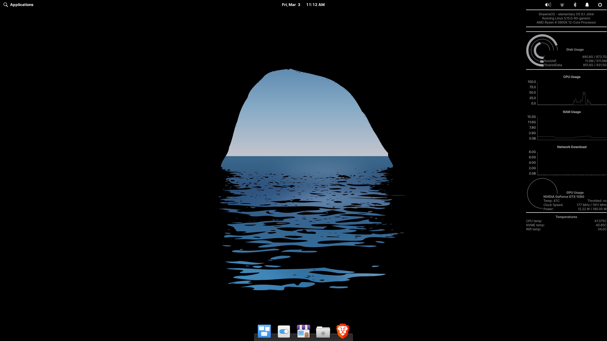
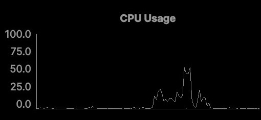

# PyWidgets

PyWidgets is a desktop widget manager using Qt and Python, built to be cross-platform and fully customizable.
Widgets are a small window of their own which can display a certain type of information (text, times, numbers, etc.) in a given style.
A sample page of widgets is included to show the capabilities without any coding required, but the intent is for users to extend the project through adding new data sources (requiring minimal coding) or designing new widgets (requiring coding and/or Qt familiarity) or both.


## Examples

**Combining pre-made data sources and widgets:**  
```python3
import pywidgets
from pywidgets.sample_data import cpu_cmds

app = pywidgets.get_application()
window = pywidgets.get_window()

data = cpu_cmds["overall usage"]
display_string = "CPU usage"
widget = pywidgets.GraphWidget(window, display_string, data)

window.add_widget(widget)
window.finish_init()
exit(app.exec())
```
This code results in the following widget, which shows the percentage use of 
the CPU over the last one minute and updates every second:  

## Features
* Cross-platform - the same widget setup can work between Linux/Windows dual boots, and/or can be used on a Mac.
* Customizable sources - any data you can access from python or from the terminal can be displayed.
* Customizable looks - widgets are created with Qt, so if you have a design in mind creating it is easy.
* Powerful - if you can think of an idea for a widget, you can probably make it.
## Motivation

I created this because I tried and enjoyed [conky](https://wiki.archlinux.org/title/Conky), but regretted not having 
the same thing on my Windows dual-boot.
Lots of widget solutions exist purely for Windows, but overall they lacked the customization I wanted and trying to 
create the same thing with two widget platforms on two different operating systems just felt like a waste of effort. 
I started building this to resolve that issue, but also mostly for fun. 

## Requirements
* Python 3.8+
* PyQt6
* psutil
* pyqtgraph
* winsdk (if you're using Windows and want the now playing widget to work)

## Installation or Getting Started

This project can be installed as a package or run in place.  

To install as a package, download the latest wheel 
from the [releases](https://github.com/shawnc722/pywidgets/releases) section and install it, plus dependencies,
with `pip install [filename]`.  

To run it in place, first install all the dependencies from the requirements 
section and then clone the project with `git clone https://github.com/shawnc722/pywidgets.git`.  

It isn't required, but the default font is [Inter](https://github.com/rsms/inter) and if it's not on your system already  
you may want to install it. If not, a different font will be automatically chosen - though you can also just specify one yourself.

To start up the sample page, just run the module: `python -m pywidgets`.

## Usage

This project can be used as-is via `python -m pywidgets`, customized using existing widgets 
and data sources, and/or extended with new widgets and data sources. The `pywidgets.sample_data` 
module provides some data sources to get you started - to see which ones and their current 
values, run it in your console with `python -m pywidgets.sample_data`. Once you've chosen a 
data source to use - for example let's go with `overall usage` from the `cpu cmds` section - 
we just need to use the titles and name to find it in `sample_data`'s `all_cmds` dict. For our 
example, that means we want `sample_data.all_cmds['cmd cmds']['overall usage']`, which returns
a [PyCmd](todo) corresponding to the current total CPU usage of the system. 

    
## Reference

+ [jxson](https://gist.github.com/jxson) - [README.md](https://gist.github.com/jxson/1784669)
+ [gistfrojd](https://gist.github.com/gistfrojd) - [README.md](https://gist.github.com/gistfrojd/5fcd3b70949ac6376f66)

Depending on the size of the project, if it is small and simple enough the reference docs can be added to the README. For medium size to larger projects it is important to at least provide a link to where the API reference docs live.

## Contributing
Any contributions to this project are more than welcome, whether that's refining the existing project, adding new widgets/sources/features, giving ideas, reporting bugs, etc.
Pull requests are great if you have code to add/edit, and otherwise creating an issue here on GitHub is probably best.

## License

This project uses Qt, so [their license](https://www.qt.io/licensing/) affects it.
Otherwise, you can do whatever you want with this project as far as I'm concerned. The only thing I'd ask is if you make 
something cool, please share it so others can use it too.
