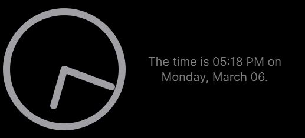
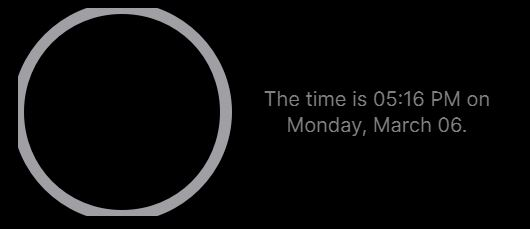

#Creating custom widgets
This is a brief explanation, with examples, of creating your own widget. As an example, 
we'll make a simple analog clock with some text beside it:  
  
The full code is in `clock_widget.py`, and `clock_test_page.py` is a sample page containing only this widget 
if you'd like to run it yourself.  

To begin creating the widget, we'll need our import statements; don't worry about them too much for now.  
```python3
from PyQt5.QtWidgets import QWidget
from PyQt5 import QtGui, QtCore
from pywidgets.JITstrings import JITstring, PyCmd
from pywidgets.widgets import TextWidget
from datetime import datetime
from math import sin, cos, pi
```
Next, we'll need to define a class for the new widget; we can call it a `ClockWidget`, 
and it should inherit from Qt5's QWidget.
```python3
class ClockWidget(QWidget):
    """A widget displaying an analog clock."""
    ...
```
Now we'll need to make the init method for our widget and decide its arguments. It should 
take its parent widget at minimum, but it's useful to have other optional variables for 
customization. These can be colors, fonts, line widths or styles, etc. For now, we'll only do
the parent and the desired height as an optional argument:
```python3
class ClockWidget(QWidget):
    """A widget displaying an analog clock."""
    
    def __init__(self, parent, height=None):
        super().__init__(parent)
```
We'll need to decide on a default size for the widget; for now, let's use 10% of the parent's height
and the full available width.
```python3
def __init__(self, parent, height=None):
    super.__init__(parent)
    height = height if height is not None else round(parent.height()/10)
    self.setFixedSize(parent.width(), height)
```
For this widget, we'll assume the parent page shape is the default, a tall stack of widgets where 
10% of the height is smaller than the width. That means we can take a square space for the 
drawing of the clock dimensions `height`x`height` and still have some space left over beside it.  
Let's make a sub-widget for the text now, after reserving some space on the left for the clock:
```python3
def __init__(self, parent, height=None):
    ...
    self.clock_size = height
    self.label = TextWidget(self)  # a TextWidget is just a QLabel wrapper w/ formatting
    # set position and size: setGeometry(x, y, w, h) relative to this widget's top left
    self.label.setGeometry(self.clock_size, 0, self.width() - self.clock_size, height)
```
We now have the basic layout we want; a square space for our clock, and an area for text on its left.
Drawing the clock will have its own function, so let's continue working on the text for now.  
For this, we'll use a `JITstring`; think of it as the `str.format()` method, but run each time
the string is accessed. The first argument is the basic string, with curly braces {} as placeholders 
for where the arguments should go. Then we give it a list of the argumments, in order. 
To get the date and time, we'll use python's datetime:
```python3
def __init__(self, parent, height=None):
    ...
    def get_time(fmt): return datetime.now().strftime(fmt)
    time = PyCmd(get_time, "%I:%M %p")
    date = PyCmd(get_time, "%A, %B %d")
    self.text = JITstring("The time is {} on {}.", [time, date])
```
Last, we need to tell our widget how often (and what) to update; being a clock, every 
second is the obvious choice. We won't actually be adding a second hand in this tutorial, 
so it's a little overkill, but the more often it refreshes the more accurate it is.
We'll tell the timer to run a method we haven't created yet, called `do_cmds()`.
```python3
def __init__(self, parent, height=None):
    ...
    update_interval = 1000  # 1 second in ms
    self.timer = QtCore.QTimer()
    self.timer.timeout.connect(self.do_cmds)
    self.timer.start(update_interval)
    self.do_cmds()
```
We call the `do_cmds()` method at the end of `__init__()` to make sure everything is ready immediately,
instead of waiting for the first 1s timer to end. Now to make this `do_cmds()` method:
```python3
def do_cmds(self):
    self.label.setText(str(self.text))
    self.update()
```
Now we have half of our clock widget: the text shows the date and time, and updates automatically.  
To make the clock portion, we'll need to override the `paintEvent()` method, which is triggered when 
we call `self.update()` every second.  
Inside this method, we should prepare to draw using Qt's QtGui tools. You can play with some of these values 
to vary the look:
```python3
def paintEvent(self, event):
    painter = QtGui.QPainter(self)
    painter.setRenderHint(QtGui.QPainter.Antialiasing)
    color = QtCore.Qt.gray
    thickness = round(self.height() / 18)  # pixels, use 1/18th of height so that it scales
    style = QtCore.Qt.SolidLine
    pen = QtGui.QPen(color, thickness, style)
    painter.setPen(pen)
```
This gives us the painter we need to draw whatever we have in mind, in this case the clock. 
Let's start with the outer circle:
```python3
def paintEvent(self, event):
    ...
    painter.drawArc(0, 0, self.clock_size, self.clock_size, 0, 360 * 16)  # x, y, width, height, start angle, span angle
    # angle units are 16th of a degree, so 16 * 360deg gives a full circle while 16 * 180deg gives half of one, etc.
```
This works, but it runs into a common problem; the edges of the circle are cut off, since 
we set the size to the max possible size and the thickness larger than 1 (shown below).  
   
To fix this, we can subtract the thickness of the line from the 
size of the circle and move it half the thickness away from the edges. This is a concept 
you'll probably run into a lot if you're drawing with Qt, so it's worth understanding.
The previous line is now:
```python3
def paintEvent(self, event):
    ...
    newsize = self.clock_size - thickness
    offset = round(thickness / 2)
    # drawArc() takes (x, y, width, height, start angle, span angle)
    # angle units are 16th of a degree, so 16 * 360deg gives a full circle while 16 * 180deg gives half of one, etc.
    painter.drawArc(offset, offset, newsize, newsize, 0, 360 * 16)
```
So we have the outer ring of our clock properly set up, and it's time to figure out where
to place the hour and minute hands. The math isn't really relevant to this tutorial, so 
if you're not big on trigonometry just skip this part:
```python3
def paintEvent(self, event):
    ...
    time = datetime.now()
        hour_angle = ((time.hour % 12) / 12) * 2 * pi  # percentage of rotation done * a full circle in radians
        minute_angle = (time.minute / 60) * 2 * pi  # percentage of a rotation done * a full circle in radians

        minute_hand_length = round(newsize / 2 - thickness)  # inner radius of the circle minus the line thickness
        hour_hand_length = .75 * minute_hand_length

        center = round(self.clock_size / 2)  # center x and y coordinates are the same, so only using one

        hour_x = center + round(hour_hand_length * sin(hour_angle))
        hour_y = center - round(hour_hand_length * cos(hour_angle))

        minute_x = center + round(minute_hand_length * sin(minute_angle))
        minute_y = center - round(minute_hand_length * cos(minute_angle))
```
Now all that's left is to actually draw the lines, and then tell the painter we're done: 
```python3
def paintEvent(self, event):
    ...
    painter.drawLine(center, center, hour_x, hour_y)
    painter.drawLine(center, center, minute_x, minute_y)
    
    painter.end()
```
That completes our basic clock widget, although it could benefit from many little tweaks like 
adding a second hand, using different thicknessess/colors, and/or rounding the edges of the lines.  
  
Using the new widget is the same as any other widget: just import it, add it to your window with add_widget(), and call 
`finish_init()` on the window.  
After this tutorial, you hopefully understand the basic idea behind these widgets and the use of JITstrings, 
and are prepared for learning more Qt5 tools to make more complex widgets.