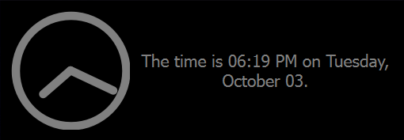
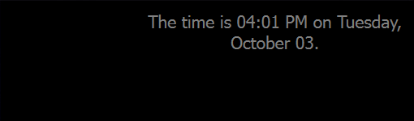
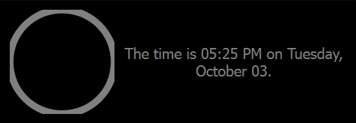
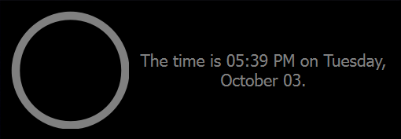

# Creating custom widgets
This is a brief explanation, with examples, of creating your own widget. As an example, 
we'll make a simple analog clock with some text beside it:  
  
The full code is in `clock_widget.py`, and `clock_test_page.py` is a sample page containing only this widget 
if you'd like to run it yourself. This tutorial assumes basic python knowledge of classes.  

The clock widget is relatively simple, but to make the tutorial more generally applicable we'll go through the whole widget creation process even when some steps aren't totally necessary here.
Before starting, we should make a `page.py` file for testing this (or add it to an existing one). If you'd rather skip creating one, you can download [`clock_test_page.py`](clock_test_page.py) and uncomment the palette lines if you want to change the colors.

## Step 1: Imports
The first step is to start a new .py file named `clock_widget.py` in your favourite IDE or plain text editor and put it in the same folder as your `page.py` so that we can import these widgets from that file. Next is getting the required imports - at minimum, the QtWidget class from Qt6.QtWidgets. We'll start with a couple more imports, but don't worry too much about what they are yet; as we go through the tutorial you'll see why each one was imported.
```python3
from PyQt6 import QtGui, QtCore, QtWidgets
from pywidgets.JITstrings import JITstring, PyCmd
from pywidgets.widgets import TextWidget
from datetime import datetime
from math import sin, cos, pi
```
The next step is to decide how we want to structure this widget. 
## Step 2: Structure and Inheritance
Since our widget is made of two discrete parts, with a graphic on the left and text on the right, we can use two separate sub-widgets to create these parts. To make our code more modular and reusable, we'll split the graphic of an analog clock into its own widget; this allows importing it and using it separately from the text. The right sub-widget will only contain text, so we can use an existing TextWidget (just a QLabel with some common formatting pre-applied, if you're already familiar with Qt) for this.  
In total for this structure, we'll want two custom widgets: an AnalogClock widget displaying the graphic, and a ClockWithDate widget combining the graphic with some text. Any custom widget should inherit from `QtWidgets.QWidget` or a subclass of it, if one is more relevant (ie QPushButton):
```python3
class AnalogClock(QtWidgets.QWidget):
    """A simple analog clock."""
    def __init__(self, parent):
        super().__init__(parent) # passing the parent along on this super() call is required for proper inheritance

class ClockWithDate(QtWidgets.QWidget):
    """A widget displaying the time and date."""
    def __init__(self, parent):
        super().__init__(parent)
```
Notice how both widgets require a `parent` argument and pass it along to their superclass on initialization; this sets the widget up with the right fonts and colors to match the style of a user's `page.py` and should be done for every widget. It's important to do this step even if you don't plan on having text or graphics in your widget, since breaking the chain of inheritance would prevent any sub-widgets of your widget from matching the style.
Now that we have the classes defined and the minimum required arguments in place, we should consider whether any other arguments are needed. We could add optional arguments for changing things like line style on the AnalogClock or the text in the ClockWithDate widget, but in this tutorial we'll only add one argument: an `update_interval` argument for the ClockWithDate, taking an integer number of milliseconds between updates of the widget. We'll need to update the `__init__()` definition for this, and then save the argument as a property:
```python3
class ClockWithDate(QtWidgets.QWidget):
    """A widget displaying the time and date."""
    def __init__(self, parent, update_interval=1000):
        super().__init__(parent)
        self.update_interval = update_interval
```
Setting a reasonable default argument (ie 1000ms or 1 second, in this case) for non-essential arguments allows customization of the widget without forcing users to choose a value every time they add a widget. Saving the argument by making it a property (`self.update_interval = ...`) allows accessing it later from other methods; in this case it's actually not necessary because we can just create the timer in the same function, but it's good practice since most other arguments would need to be saved this way.  
Next, we'll want to create any other properties our widgets will need; the AnalogClock has everything it needs for this step, so we'll only look at ClockWithDate. We'll need to create the two sub-widgets here; one AnalogClock (which doesn't do anything yet, but we'll get to that) and one TextWidget to show the date:
```python3
class ClockWithDate(QtWidgets.QWidget):
    """A widget displaying the time and date."""
    def __init__(self, parent, update_interval=1000):
        ...
        self.clock = AnalogClock(self)  # here the parent of this AnalogClock is this widget, or 'self'
        self.label = TextWidget(self)  # a TextWidget is just a QLabel wrapper w/ formatting, perfect for text (if you hadn't guessed)
```
We have the required widgets created now, so the next step is deciding where they go.
## Step 3: Widget Layout
Next we'll need to tell our `ClockWidget` to display these two sub-widgets, and how. For this we use one of Qt's many [Layouts](https://doc.qt.io/qt-6/layout.html); in this case we want the two widgets arranged horizontally, so we'll use the `QHBoxLayout`:
```python3
class ClockWithDate(QtWidgets.QWidget):
    """A widget displaying the time and date."""
    def __init__(self, parent, update_interval=1000):
        ...
        layout = QtWidgets.QHBoxLayout()  # create the desired type of layout
        
        # add widgets in order: (note stretch is optional)
        layout.addWidget(self.clock, stretch=1)  # stretch is the ratio between the widths
        layout.addWidget(self.label, stretch=2)  # ie for every 1 px in width the clock has, the label has 2 px
        
        self.setLayout(layout) # finally, add the layout to the main widget
```
We now have the layout we want; the clock portion is on the left (added first) taking a third of the space (determined by the two stretch arguments) and the text takes up the rest. Since our two sub-widgets are both empty right now, we can't actually see our layout in action yet - once we've got something in place for both, you can play around with the order and stretch factors to get an intuitive idea of how they work. You might also notice we haven't specified vertical sizes, or even any absolute pixel values; this is because Qt's layout design is responsive and will automatically give the minimum required space to our widget. We'll put a restriction on our AnalogClock to limit it to a square aspect ratio in a later step, and this will determine the height of our final widget. For now, let's handle the date portion:  
## Step 4: Data
This part is usually passed in as an argument for most widgets, to allow them to be reusable for other data; in this case we'll just create it ourselves. For this, we'll use a `JITstring`; think of it as the `str.format()` method, but run each time the string is accessed rather than only once. The first argument is the basic string, with curly braces {} as placeholders for where the arguments should go. Then we give it a list of the arguments, in order. 

To get the date and time, we'll use python's datetime. A [PyCmd](todo) (similar to functools.partial) is a way of baking arguments into a function so it can be run without them later. You pass the function itself (`get_time`, in our case) followed by the arguments it should be run with (the format strings accepted by datetime). The resulting PyCmd can be called or just treated like the result of the function call; once the two PyCmds are defined `print(time())`, `print(str(time))` and `print(time)` work equally well. In this case, the PyCmds are passed to the JITstring to be run anytime the string is shown:
```python3
class ClockWithDate(QtWidgets.QWidget):
    """A widget displaying the time and date."""
    def __init__(self, parent, update_interval=1000):
        ...
        def get_time(fmt): return datetime.now().strftime(fmt)
        time = PyCmd(get_time, "%I:%M %p")
        date = PyCmd(get_time, "%A, %B %d")
        self.text = JITstring("The time is {} on {}.", [time, date])
```
Now that our text is handled and is capable of changing, we need to actually make our clock update. 
We'll tell the timer to run a method we haven't created yet, called `do_cmds()`.
```python3
class ClockWithDate(QtWidgets.QWidget):
    """A widget displaying the time and date."""
    def __init__(self, parent, update_interval=1000):
        ...
        self.timer = QtCore.QTimer()  #  create the timer
        self.timer.timeout.connect(self.do_cmds)  # tell it what it should actually do when it ticks
    
        self.timer.start(self.update_interval)  # start the timer
        self.do_cmds()  # update immediately so the widget displays properly on first load
```
We call the `do_cmds()` method at the end of `__init__()` to make sure everything is ready immediately,
instead of waiting for the first 1s timer to end. 
Now to make this `do_cmds()` method, which runs every time the timer ticks and should update our text and clock:
```python3
class ClockWithDate(QtWidgets.QWidget):
    """A widget displaying the time and date."""
    ...
    def do_cmds(self):
        self.label.setText(str(self.text))  # sets the text to an up-to-date copy of the string produced by self.text
        self.update()  # tells Qt it's time to redraw this widget, forcing the graphics portion (our clock) to refresh
```

At this point we have half of our clock widget: the text shows the date and time, and updates automatically every second by default.  The size of our widget is now determined by the amount of text; this might work in some cases, but for our use case we should change that.  
## Step 5: Widget Size
The final size of our widget will be determined by the sizes of the widgets inside it - currently, only the TextWidget is contributing to the size (using the left 2/3 of the horizontal space because of our layout options) and the clock graphic is just a placeholder. Here, we'll add some height to the graphic as well. The first step is to add a `sizeHint()` method; this tells Qt the preferred size of the widget by returning a `QSize` object:
```python3
class AnalogClock(QtWidgets.QWidget):
    """A simple analog clock."""
    ...
    def sizeHint(self):
        return QtCore.QSize(self.width(), self.width())  # return a square size, determined by the width of the widget
```
By doing this, Qt knows we want the widget to ideally be a square, but it will grow and shrink in either direction as the available space changes. Since our clock should be a circle rather than an oval, we'll need to enforce the square aspect ratio using a SizePolicy:
```python3
class AnalogClock(QtWidgets.QWidget):
    """A simple analog clock."""
    def __init__(self, parent):
        ...
        policy = QtWidgets.QSizePolicy()  # get a new QSizePolicy
        policy.setHeightForWidth(True)  # make this policy indicate this widget's height depends on its width
        self.setSizePolicy(policy)  # and set the policy of this widget to our new policy
```
`QSizePolicy` has many other options worth looking into if your widget needs a nonstandard size. This one (`setHeightForWidth()`) just tells Qt that our widget determines its height based on its width; now that we've told Qt this, we need to make sure it's true by creating a `heightForWidth(width)` method on our widget. This method takes the available width as an argument and returns the widget's desired height at that width:
```python3
class AnalogClock(QtWidgets.QWidget):
    """A simple analog clock."""
    ...
    def heightForWidth(self, width): return width  # when asked what height to use for a width, return that width
```
We return the same width passed in to ensure the AnalogClock has a square canvas so it draws a circle rather than an oval. We could also do things like returning twice the width to make the widget twice as tall as it is high, or using `policy.setWidthForHeight(True)` and defining `widthForHeight(height)` instead to control width based on height. Note that for either of these functions, width and height refer to pixels so they have to be integers - if you're doing any sort of division or multiplication by a float, you should call `round()` on the final value to ensure you give Qt valid dimensions.  
Now our AnalogClock is square and uses all available space - because we've added it to our layout in ClockWithDate, it has one third of the total width available to it and will use that for height as well. The only difference visually is that the text is now vertically centered in the height of the AnalogClock - so now it's time to draw our clock.
## Step 6: Drawing
Drawing in Qt is handled by overriding a widget's `paintEvent()` method. Inside this method, we need to create a QPainter object:
```python3
class AnalogClock(QtWidgets.QWidget):
    """A simple analog clock."""
    ...
    def paintEvent(self, event):  # Qt will pass a QPaintEvent object when it calls this method, but we can ignore it here
        painter = QtGui.QPainter(self)  # create the actual painter object, which allows us to draw on the widget
        painter.setRenderHint(QtGui.QPainter.RenderHint.Antialiasing)  # tell it to use antialiasing (usually worth using)
```
The next step is to create a pen for the painter to use; this will require a color, a thickness, and a style (dashed, dotted, etc). We can use any style, but colors in a widget (in the pywidgets project, at least) should nearly always be taken from the user's palette rather than hardcoded in, so that the widget is responsive to the user's color choices in their `page.py`. Calling `self.palette()` in any widget that properly inherits from the main Window returns the correct palette, which offers different color roles (accessible as methods of the palette) you can choose from to use. Main widget graphics should generally use the primary color (ie `self.palette().window().color()`), so that's what we'll use.  
For the line thickness, it's best to use fractions of the font height (accessible with `self.fontMetrics().height()`) so that it scales with the user's text size preferences.
```python3
class AnalogClock(QtWidgets.QWidget):
    """A simple analog clock."""
    ...
    def paintEvent(self, event):  # Qt will pass a QPaintEvent object when it calls this method, but we can ignore it here
        ...
        thickness = round(self.fontMetrics().height() / 2)  # pixels, use a size relative to font height so it scales
        style = QtCore.Qt.PenStyle.SolidLine  # could be DashLine, DotLine, or many others (including custom)
        color = self.palette().window().color()  # the window color is for your main graphics
        pen = QtGui.QPen(color, thickness, style)  # here we create the pen
        pen.setCapStyle(QtCore.Qt.PenCapStyle.RoundCap)  # we want the ends to look nice instead of being rectangular
        painter.setPen(pen)  # finally, tell the painter this is the pen we're using
```
Now we're all set for drawing - we can begin drawing the clock with a simple circle as large as the widget itself (remember  we're drawing in the AnalogClock widget, which is square and 1/3 the width of our outer ClockWithDate widget):
```python3
class AnalogClock(QtWidgets.QWidget):
    """A simple analog clock."""
    ...
def paintEvent(self, event):
    ...
    clock_size = self.width()  # we want the clock to cover this whole widget (for now)
    painter.drawArc(0, 0, clock_size, clock_size, 0, 360 * 16)  # x, y, width, height, start angle, span angle
    # angle units are 16th of a degree, so 16 * 360deg gives a full circle while 16 * 180deg gives half of one, etc.
```
If we run the widget now (though we'd need to tell the painter we're done, first, using `painter.end()`) we'd get the following result:   
This shows one of the main things to be aware of when drawing with widgets; your lines have thicknesses which go outside the boundaries of the shapes you draw. In this case, it results in the outer edges of the circle being outside the AnalogClock widget, which means they aren't drawn. In other cases it can cause shapes clipping together when you didn't intend them to, or other sometimes hard-to-troubleshoot problems. To resolve this, we have to draw the circle at a size where the outer half of the line reaches but doesn't leave the edge of the widget; this means changing the previous code snippit to
```python3
class AnalogClock(QtWidgets.QWidget):
    """A simple analog clock."""
    ...
def paintEvent(self, event):
    ...
    clock_size = self.width() - thickness  # the diameter of the clock has half the thickness on either side
    offset = round(thickness / 2)  # we need to move the clock away from the edges by half the line thickness
    painter.drawArc(offset, offset, clock_size, clock_size, 0, 360 * 16)  # x, y, width, height, start angle, span angle
    # angle units are 16th of a degree, so 16 * 360deg gives a full circle while 16 * 180deg gives half of one, etc.
```
This accounts for the line thickness when drawing the clock to ensure it's placed and sized right to take up (only) the whole widget, like below (note again that to see this yourself, you'll have to make sure to add `painter.end()`: 
Next, we can draw the clock hands. To do this we'll need to know what angle they should be at, which we can get using the `datetime.now()` function and some math. The math isn't really relevant to this tutorial, so if you're not big on trigonometry just copy this code and don't worry about it:
```python3
class AnalogClock(QtWidgets.QWidget):
    """A simple analog clock."""
    def paintEvent(self, event):
        ...
        time = datetime.now()
        # note that time.hour and time.minute start at 0, so we use 11 hours instead of 12 and 59 min instead of 60
        hour_angle = ((time.hour % 11) / 11) * 2 * pi  # percentage of rotation done * a full circle in radians
        minute_angle = (time.minute / 59) * 2 * pi  # percentage of a rotation done * a full circle in radians
        
        minute_hand_length = round(clock_size / 2 - thickness)  # inner radius of the circle minus the line thickness
        hour_hand_length = .75 * minute_hand_length  # make the hour hand 75% of the length (seems roughly right)
    
        center = round(self.width() / 2)  # center x and y coordinates are the same, so only using one
    
        hour_x = center + round(hour_hand_length * sin(hour_angle))
        hour_y = center - round(hour_hand_length * cos(hour_angle))
    
        minute_x = center + round(minute_hand_length * sin(minute_angle))
        minute_y = center - round(minute_hand_length * cos(minute_angle))
```
The important part here is that we know we need to draw two lines to represent the hour and minute hands, and we now have the start and end coordinates of those lines. Now all that's left is to actually draw the lines, and then tell the painter we're done. We could make changes to the pen (ie color, thickness, style) and call `painter.setPen(pen)` again to style the hands differently, but I'll stick with the default here: 
```python3
class AnalogClock(QtWidgets.QWidget):
    """A simple analog clock."""
    def paintEvent(self, event):
        ...
        painter.drawLine(center, center, hour_x, hour_y)
        painter.drawLine(center, center, minute_x, minute_y)
        
        painter.end()
```
This results in our completed widget, like below: 
Using the new widget is the same as any other widget: just import it, add it to your window with `window.add_widget()`, and call `finalize()` on the window before you start the app with `pywidgets.start()`.  
After this tutorial you hopefully understand the basic idea behind these widgets and the use of JITstrings, and are prepared for learning more Qt6 tools to make more complex widgets.